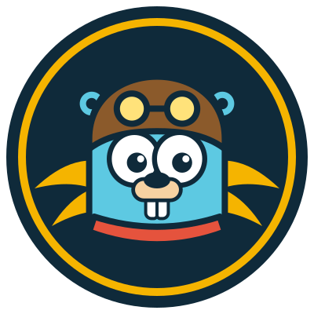
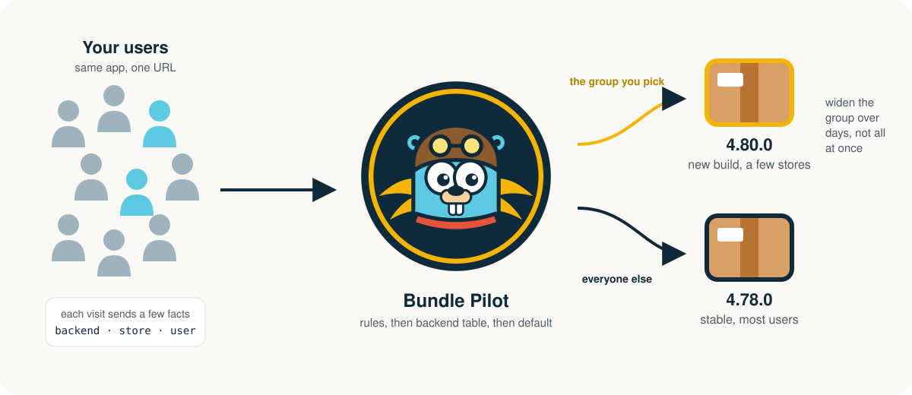
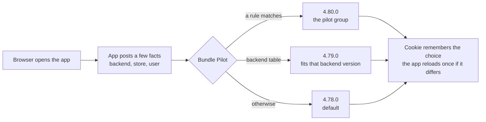
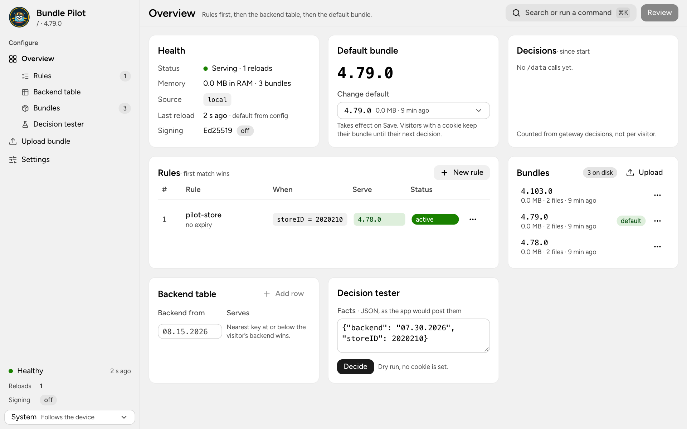

<p align="center">
  
</p>

<h1 align="center">Bundle Pilot</h1>

<p align="center">
  Ship a new frontend to some of your users before all of them.<br>
  One URL, several builds side by side, and you decide who runs which.
</p>

<p align="center">
  <a href="LICENSE"></a>
  <a href="https://github.com/zenkiet/bundle-pilot/releases"></a>
  <a href="https://github.com/zenkiet/bundle-pilot/actions/workflows/release.yml"></a>
  <a href="https://go.dev"></a>
  <a href="https://svelte.dev"></a>
  <a href="libs/README.md"></a>
  <a href="https://github.com/zenkiet/bundle-pilot/pkgs/container/bundle-pilot"></a>
  <a href="https://github.com/zenkiet/bundle-pilot/issues"></a>
</p>

<p align="center">
  <a href="#why-bundle-pilot">Why</a> ·
  <a href="#how-it-works">How it works</a> ·
  <a href="#what-you-get">What you get</a> ·
  <a href="#quick-start">Quick start</a> ·
  <a href="#a-rollout-step-by-step">A rollout</a> ·
  <a href="#client-libraries">Client libraries</a> ·
  <a href="#admin-ui">Admin UI</a> ·
  <a href="#documentation">Documentation</a> ·
  <a href="#building-from-source">Building from source</a>
</p>

## Why Bundle Pilot

Many teams serve one web app to many customers: stores, tenants, branches,
partners. The app grows old, a big upgrade gets built, and then comes the
hard part. Shipping it means every user gets the new build at the same
moment, on the same day, whether their backend is ready or not. Not shipping
it means the upgrade waits, sometimes for years, because nobody wants to bet
the whole user base on one deploy.

Bundle Pilot removes that bet. It keeps every build you still need, old and
new, behind the same URL, and routes each visitor to one of them. A handful
of stores run the new build this week. If they are happy, more stores follow.
If something breaks, one edit sends them back to the old build, without a
redeploy and without touching the other users. The rollout becomes a dial
you turn, not a switch you flip.

The project was born from exactly that situation: a company whose clients all
ran one aging frontend, an upgrade ready to go, and a team that was not
willing to put 100% of the users on it on day one.

## How it works

<p align="center">
  
</p>

Every build is a zip in a folder or a bucket. Each time the app starts, it
sends Bundle Pilot a few facts about the visitor: which backend it talks to,
which store or user it is. Bundle Pilot answers with one build and the
browser reloads once if it is running a different one. The answer is
remembered in a cookie, so a user stays on the same build until you change
the rules.



Three things decide, in this order:

| Priority | Decision | What it does |
|:---:|---|---|
| 1 | **Rules** | The first rule whose conditions all match. Exact values, lists, version ranges, a stable percentage of users, with an optional expiry date. |
| 2 | **Backend table** | The newest build that fits the backend version the app reported, so a frontend never runs ahead of its API. |
| 3 | **Default** | What everyone else gets. |

## What you get

| Capability | What it means |
|---|---|
| **Builds side by side** | Old and new versions serve at once; hashed files resolve across all of them, so a session that was open during a switch never breaks. |
| **Targeting without code** | Pick users by store, tenant, user id, app version, backend version, or a percentage that only grows as you raise it. |
| **An admin UI** | Upload zips, edit rules, test a decision before saving, watch what is being served. Works on a phone as well as a desktop. |
| **A first run that sets itself up** | Project name, admin password, bundle source and default build in five steps; the admin API is then protected by HTTP Basic auth. |
| **Bundles from a folder or a bucket** | Point it at a directory, or at S3, Cloudflare R2, MinIO and the like, and it mirrors the zips by itself. |
| **Signed bundles** | Optionally, so only builds signed with your key can serve. |
| **One small binary** | No database, everything in RAM, roughly ten microseconds of CPU per request. Docker images for amd64 and arm64, binaries for macOS, Windows and Linux. |

## Quick start

### Run with Docker

Put each build in a zip named by its version, with `index.html` at the root
of the zip, and start the gateway on that folder:

```sh
mkdir -p dist/versions
cp 4.78.0.zip 4.80.0.zip dist/versions/
docker run -p 8080:8080 -v "$PWD/dist:/app/dist" ghcr.io/zenkiet/bundle-pilot
```

Open `http://localhost:8080/__gateway/ui/`. The first visit runs the setup
wizard; after that, the app itself is served at `http://localhost:8080/` and
the newest build is the default until you say otherwise.

### Or run the binary

Prefer a binary? Download one from the
[releases](https://github.com/zenkiet/bundle-pilot/releases) and run
`DIST=./dist ./bundle-pilot`. Everything on disk is two things: the
`versions/` folder and one `config.pb` written by the UI.

### Connect your app

Then teach the app to ask. For Angular, one provider does it; for any other
framework, a few lines of fetch. See [Client libraries](#client-libraries).

## A rollout, step by step

1. **Upload the new build.** Drop `4.80.0.zip` on the Upload page, or `PUT`
   it to the API from CI. Nobody sees it yet: the default is still `4.78.0`.
2. **Pick the pilot group.** Add a rule: store `2020210` gets `4.80.0`. Save.
   The next time that store opens the app, it reloads into the new build.
3. **Widen.** Change the rule to a list of stores, then to `10%` of users, then
   `50%`. The percentage is stable per user, so raising it only adds people.
4. **Finish or back out.** Make `4.80.0` the default and delete the rule, or,
   if something is wrong, delete the rule and the pilot group is back on
   `4.78.0` at their next visit.

The same config, written as JSON:

```json
{
  "default": "4.78.0",
  "rules": [
    { "id": "pilot-stores", "when": { "storeID": [2020210, 2020215] }, "bundle": "4.80.0" },
    { "id": "ten-percent",  "when": { "user": "10%" },                  "bundle": "4.80.0" }
  ]
}
```

## Client libraries

The app has to send its facts and reload when the answer changes. The
`libs/` folder ships that logic as packages:

| Package | For | Status |
|---|---|---|
| `@bundle-pilot/angular` | Angular 19 to 22, one `provideBundlePilot()` call | Ready |
| `@bundle-pilot/core` | Any framework or plain JavaScript, the same logic without Angular | Ready |
| React and Vue adapters | Thin wrappers over `core` | Planned |

```ts
// app.config.ts
provideBundlePilot({
  facts: () => ({ backend: settings.backendVersion, storeID: settings.storeId }),
  resyncOn: () => inject(AuthService).user$,
});
```

Setup, options and the plain fetch snippet are in [libs/README.md](libs/README.md).

## Admin UI

<p align="center">
  
</p>

Overview shows what is being served and lets you change it. Upload takes
zips, checks them and reloads the gateway. Settings holds what the setup
wizard asked: project name, admin account, bundle source and default build.
Every change goes through a review step before it is saved, and the decision
tester shows what a visitor with given facts would get, without saving
anything.

## Documentation

| Resource | Covers |
|---|---|
| [docs/reference.md](docs/reference.md) | The config contract, rule syntax, bundle sources, every endpoint, environment variables, signing and deployment checks. |
| [libs/README.md](libs/README.md) | The client packages. |
| `proto/bundlepilot/config/v1/config.proto` | The config as a protobuf contract. |

## Building from source

Requires Go 1.27, Node 22 and pnpm.

```sh
make ui             # build the admin UI into internal/ui/build
make build          # bin/gateway, with the UI embedded
make gen            # regenerate Go and TypeScript from proto/
make lint           # golangci-lint, including layer rules
docker compose up --build
```

Releases are built by GoReleaser from a `v*` tag: archives for macOS (Intel
and Apple silicon), Windows and Linux, and a multi-arch image on
`ghcr.io/zenkiet/bundle-pilot`.

## Contributing

Bug reports, feature requests and pull requests are welcome. Please open an issue before starting large changes so the design can be agreed first; every user-facing change in Soteria starts as a mockup.

## License

Bundle Pilot is free software, released under the [Apache-2.0](LICENSE).

<p align="center"><sub>© 2026 ZenSoftware. All rights reserved.</sub></p>
